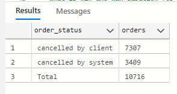
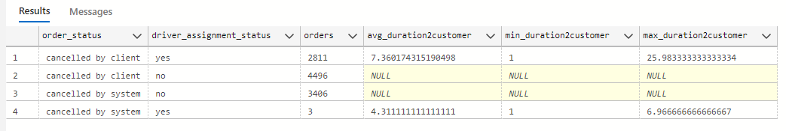

# GetTaxi-Rides-Cancellations
 
&nbsp;

## Project Overview
<p align="justify">
Gett, previously known as GetTaxi, is an Israeli-developed technology platform solely focused on corporate Ground Transportation Management (GTM). They have an application where clients can order taxis, and drivers can accept their rides (offers). At the moment, when the client clicks the Order button in the application, the matching system searches for the most relevant drivers and offers them the order. In this task, i investigated some matching metrics for orders that were not completed successfully, i.e., the customer didn't end up getting a car.
</p>
  
&nbsp;

## Data Source
These Datasets were gotten from Stratascatch, a platform for solving Data Science problems. The platform provided two tables data_orders and data_offers

### 📖 Data Dictionary — data_orders  

| **Column Name**              | **Description**                                                                 |
|------------------------------|---------------------------------------------------------------------------------|
| `order_gk`                   | Unique identifier for each order                                                 |
| `order_datetime`             | Date and time when the order was created                                         |
| `origin_longitude`           | Longitude of the customer’s pickup location                                      |
| `origin_latitude`            | Latitude of the customer’s pickup location                                       |
| `m_order_eta`                | Estimated time of arrival for driver to reach the customer (in minutes)          |
| `cancellations_time_in_seconds` | Time (in seconds) before cancellation occurred after order placement          |
| `order_status_key`           | Status code of the order: 4 - cancelled by client, 9 - cancelled by system, i.e., a reject)                            |
| `is_driver_assigned_key`     | Indicates whether a driver was assigned (1 = Yes, 0 = No)                        |


&nbsp; 
### 📖 Data Dictionary — data_offers  

| **Column Name**              | **Description**                                                                 |
|------------------------------|---------------------------------------------------------------------------------|
| `order_gk`                   |Order number, associated with the same column from the `data_orders` dataset                                                |
| `offer_id`                   |  Unique identifier of an offer                                                  |


&nbsp; 

### Tools
- SQL Server : Data cleaning, manipulation and analysis

&nbsp; 

### Tasks
- Build up distribution of orders according to reasons for failure: cancellations before and after driver assignment, and reasons for order rejection. Analyse the resulting plot. Which category has the highest number of orders?
- Plot the distribution of failed orders by hours. Is there a trend that certain hours have an abnormally high proportion of one category or another? What hours are the biggest fails? How can this be explained?
- Plot the average time to cancellation with and without driver, by the hour. If there are any outliers in the data, it would be better to remove them. Can we draw any conclusions from this plot?
- Plot the distribution of average ETA by hours. How can this plot be explained?

&nbsp; 

### Data Cleaning and Preparation

```sql
CREATE VIEW Getti_cancellations AS 
SELECT
    order_gk,
    order_datetime,
    origin_longitude,
    origin_latitude,
    m_order_eta,
    cancellations_time_in_seconds,
    CASE WHEN order_status_key = 4 THEN 'cancelled by client'
         WHEN order_status_key = 9 THEN 'cancelled by system'
    END AS order_status,
    CASE WHEN is_driver_assigned_key = 1 THEN 'yes'
         WHEN is_driver_assigned_key = 0 THEN 'no'
    END AS driver_assignment_status
  FROM 
    data_orders
  ```
<p align="justify">
I created a view to select that attributes I needed from the dataset and simplified the values in the `order_status_key` and `is_driver_assigned_key` columns by replacing numeric codes (such as 4, 9, 1, and 0) with more meaningful text labels.
</p>
    

### Exploratory Data Analysis

```sql

SELECT
  ISNULL(order_status,'Total') AS order_status,
  COUNT(order_gk) AS orders
FROM Getti_cancellations
GROUP BY  ROLLUP(order_status)
```

#### Query Output


The query reveals that most of the cancelled orders were by the customers; they cancelled 7,307  out of the 10,716 and the remaining 3409 were by the company system.


### But 🤔,Do they cancel before or after a driver has been assigned? 

```sql
SELECT
  order_status,
  driver_assignment_status,
  COUNT(order_gk) AS orders,
  AVG(m_order_eta/60) avg_duration2customer,
  MIN(m_order_eta)/60 min_duration2customer,
  MAX(m_order_eta)/60 max_duration2customer
FROM Getti_cancellations
GROUP BY  order_status,driver_assignment_status
```
#### Query Output


4496 of orders cancelled by customers were done before a driver could be assigned while the remaining  2811 of them has been assigned to a driver before cancellation.

### But 🤔,Why were they cancelled after a driver has been assigned? 

For those records, the query shows that the minimum estimated ride time to reach the customer is 1 hour, while the maximum is approximately 26 hours — which could be a red flag, especially if the client is in a hurry to reach their destination leading to cancellation.


